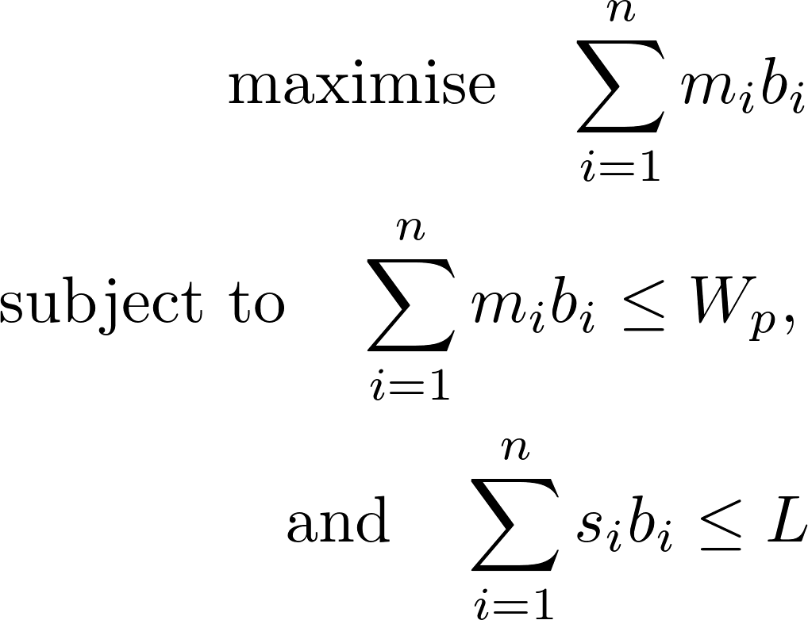

# Aircraft Loading Problem
## Airbus Quantum Computing Challenge
The [Airbus Quantum Computing Challenge](https://www.airbus.com/innovation/airbus-quantum-computing-challenge/Problem-statements.html) is a set of problems which Airbus has designed where the challenge is to implement the solutions on a quantum computer. This project looks specifically at ***Problem Statement 5: Aircraft Loading Optimisation***. 

Try out the current version of the solver [here](https://airbus.dylanlewis.me). It currently does **not** work with IE or Edge. The server is only one vCPU, with 3 [gevent](http://www.gevent.org/index.html) workers, but it still manages the example optimisations with relative ease.

## Application details
The application uses the web micro-framework Flask to interact with the linear programming tools. Flask allows a simple index route to be defined in `main.py` with several forms defined in `app/forms.py`. These forms allow new settings to be input by the user. All the settings are saved to the client using session cookies so multiple client connections do not interfere with each other. The data is saved to the client as a JSON object which is converted to Python objects for manipulation via the Block and BlockList classes located in `app/blocks.py`. JavaScript functions in `static/main.js` use `fetch` to to allow the client to request JSON objects containing the results of the linear programming steps from the server. The linear programs are contained in `app/lp.py`. 

## Two linear programs
There are currently two linear programs. The notation and labels are consistent between the linear programs. The total number of blocks being considered is *n*, although the solution will only have *N* blocks. The length of the fuselage is *L*, this is in units of type 1 cargo blocks. The maximum payload of the fuselage is *W*. The index *i* indicates a cargo block, so *s<sub>i</sub>* is the size of block *i*, and *m<sub>i</sub>* is the mass of block *i*. *s<sub>i</sub>* can be 0.5, 1 or 2. *b<sub>i</sub>* is 1 if block *i* is in the fuselage and 0 if block *i* is not in the fuselage. The index *j* indicates a section of the fuselage, so *j* goes from 1 to *L*. 

### Step one
The first linear program is significantly simpler than the second and therefore runs very quickly. It takes the list of all available cargo blocks and returns the subset of cargo blocks which maximises the mass of the cargo blocks without exceeding the maximum weight limit or the length of the fuselage. 
<div align="center">

</div>
<!--$$ \textrm{maximise} \quad \sum_{i=1}^{n}m_ib_i  
   \\  \textrm{subject to} \quad \sum_{i=1}^{n}m_ib_i \leq W_p ,
   \\ \textrm{and} \quad \sum_{i=1}^{n}s_ib_i \leq L $$-->

In words, we want to maximise the mass of the blocks in the fuselage by summing the mass of all the blocks which appear in the fuselage. This is subject to the constraints that the mass of all the blocks that appear in the fuselage is less than the maximum payload, and also that the size of all the blocks that appear in the fuselage is less that the length.

### Step two
The second linear program is more complicated as we have to fit the blocks into the fuselage such that the centre of gravity is in the centre (this could be set to an arbitrary position, here we just choose the centre for simplicity). The linear program involves introducing a matrix, *x<sub>ij</sub>*, which is 1 if block *i* is in sections *j*, and 0 otherwise. This means two blocks can have the same *j* index if they are both size 0.5. A block of size 2 is in both section *j* and *j*+1. The resulting linear program is:

<div align="center">

</div>

<!--$$ \textrm{minimise} \quad \sum_{i,j}x_{ij}m_j\left(j-\tfrac{L-1}{2}\right) \left[1-\tfrac{1}{3}\left(s_i-\tfrac{1}{2}\right)\left(s_i-1\right)\right]
    \\ \textrm{subject to constraints, 1): } \sum_{i,j}x_{ij}m_j\left(j-\tfrac{L-1}{2}\right) \left[1-\tfrac{1}{3}\left(s_i-\tfrac{1}{2}\right)\left(s_i-1\right)\right] \geq 0
    \\ \textrm{and 2) for all fuselage sections (j):  } \sum_{i=1}^{n}x_{ij}\left[s_i-\tfrac{2}{3}\left(s_i-\tfrac{1}{2}\right)\left(s_i-1\right)\right] \leq 1 
    \\ \textrm{and 3) for all cargo blocks (i):  } \sum_{j=1}^{L}x_{ij} - s_i - \tfrac{2}{3}\left(1-s_i\right)\left(2-s_i\right)= 0
    \\ \textrm{and 4) for all size 2 cargo blocks (i):  } \sum_{j=1}^{L}x_{ij}j(-1)^j \leq 1 \quad \textrm{and} \quad \sum_{j=1}^{L}x_{ij}j(-1)^j \geq -1 $$-->

We want to minimise the torque around the centre position, so this is minimising the torque of all the individual blocks where the torque is the mass of the block *i* if *i* is in position *j* around the centre point *j*-(*L*-1)/2 <!--$\left(j-\tfrac{L-1}{2}\right)$-->where the last term gives a 1/2<!--$\tfrac{1}{2}$--> if the block is size 2 as it is in two positions. The contraints can be described as follows:

1) The torque must be greater than or equal to 0, or it will just go to a maximally negative number since it is being minimised. Due to symmetry it doesn't matter if we pick out minimise and constrain to being greater than or equal to 0, or if we maximised and constrain to be less than or equal to 0.
2) (j) for each fuselage section, we have a constraint that means that position *j* can only have one block, two half blocks, or no blocks. Size two blocks count as one block in two neighbouring positions, so they are also accounted for.
3) (i) for each block, we have the constraint that the block can only be in one place, or must be in two places if the block is size two.
4) (i) for each size two block, we have the constaint that the two positions of the block must be neighbouring.

## Running locally for testing and development
Docker can be used to run this  project locally, which may be easiest as it doesn't require any additional downloads. Install docker by following the [Docker installation guide](https://docs.docker.com/install/) for either Windows, Linux or MacOS. However, Docker is not required, and the project can be run locally if any of the linear programming solvers have been downloaded (GLPK, COIN-OR, or the PULP-CBC sovler).

### The environment variables
Once the repo has been cloned and Docker has been installed, make a .env file with three environment variables:
```
FLASK_APP=main.py
FLASK_DEBUG=0
SOLVER=glpk
SECRET_KEY=supersecretunguessablekey
```
`FLASK_DEBUG` can be set to 1 if you are not using Docker. This makes testing and developing easier. To run in the Docker, the `SOLVER` environment variable must be set to `glpk`. However, if running locally, `default` or `COIN` can also be used if you have the correct packages installed on your computer.

### With Docker
You can now simply build the image, which I have named "airbus", from within the project directory: 
```
docker build -t airbus .
```
Then run the image 
```
docker run --name airbus -p 8000:5000 --rm --env-file=.env airbus
```
This builds a container which is accessible on port 8000. So visit `127.0.0.1:8000`/`localhost:8000` in a web browser to use the application. Currently, IE and Edge do **not** work. 

### Without Docker
To run from terminal with the web micro-framework [Flask](http://flask.pocoo.org/), it is easiest to use pipenv to install all the requirements. Pipenv creates a virtual environment for Python and manages the packages and versions required. It essentially combines venv and pip into one package and is really easy to use. See [this guide](https://pipenv.readthedocs.io/en/latest/install/) for installing pipenv. 

In the project directory, run 
```
pipenv install
```
followed by
```
pipenv run flask run
```
The environment variables should be picked up automatically and the Flask application should be running on port 5000. So visit `127.0.0.1:5000`/`localhost:5000` in a web browser to use the application. Currently, IE and Edge do **not** work. If `FLASK_DEBUG` is set to 1, any changes to the .py files should automatically trigger a reload of the Flask built-in development server without having to restart the Flask application manually. 